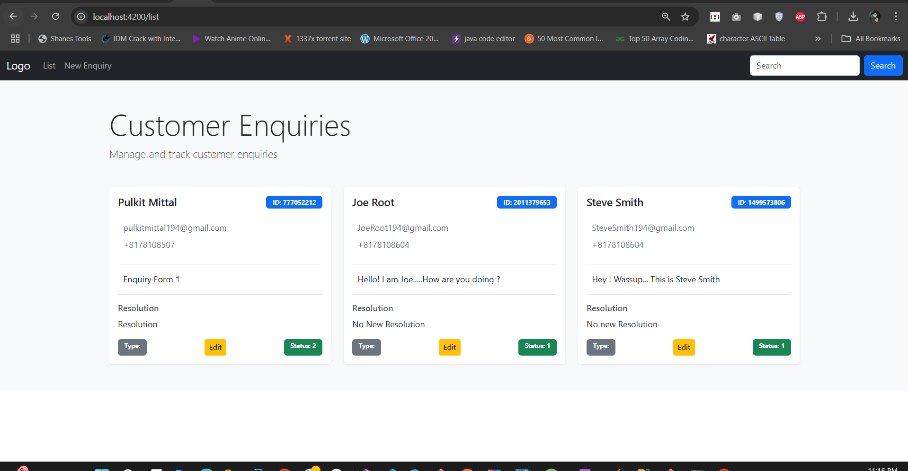
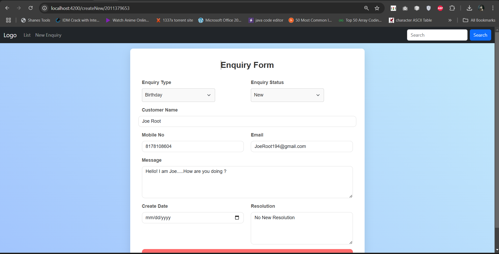
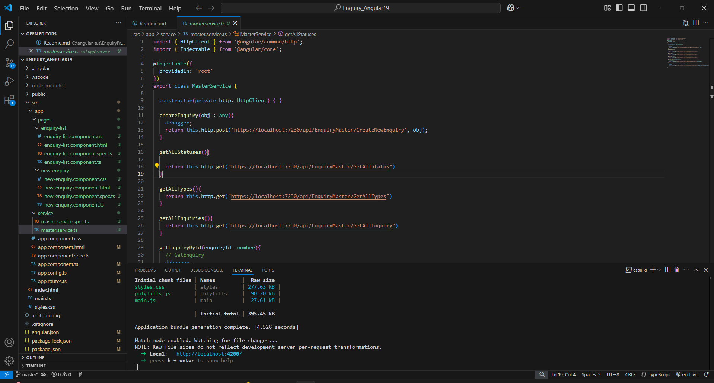
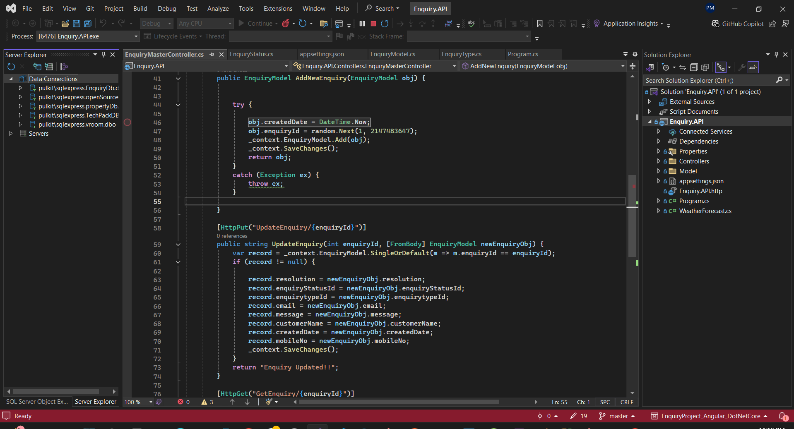
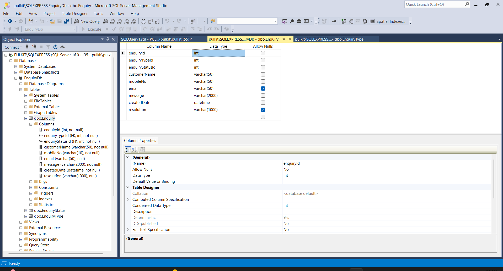

# 📝 **Enquiry Management System**

Welcome to the **Enquiry Management System**! This full-stack web application is built with **Angular v19** on the frontend and **.NET Core** on the backend. It's designed to provide a seamless experience for managing enquiries, offering functionalities like **Create**, **Edit**, and **Display** using a responsive UI.

## ✨ **Key Features**

- **User-friendly Interface**: View, create, and edit enquiries with a sleek design using **Bootstrap cards**.
- **Complete CRUD Operations**: Effortlessly manage enquiries with **Create**, **Read**, **Update**, and **Delete** operations.
- **Secure Data Handling**: Backend powered by **.NET Core APIs** and data stored securely in **MS SQL Database**.
- **Admin Features**: Retrieve user data for easy management and monitoring.

## 🚀 **Tech Stack**

- **Frontend**: Angular v19
- **Backend**: .NET Core
- **Database**: MS SQL Server
- **UI Framework**: Bootstrap
- **APIs**: RESTful CRUD APIs

## 🛠️ **How It Works**

1. **Create an Enquiry**:  
   Use the form to **add new enquiries**.  
   

2. **View Enquiries**:  
   All your enquiries are displayed in **clean, organized cards**.  
   

3. **Edit an Enquiry**:  
   Easily **modify** existing enquiries with the update option.  
   

4. **Delete an Enquiry**:  
   Remove unwanted enquiries with a **single click**.  
   

## 💻 **Installation & Setup**

Clone the repo and follow the steps to set up both the frontend and backend locally:

```bash
# Clone the repository
git clone https://github.com/PulkitMitt/EnquiryApp_Angularv19DotNet.git

# Navigate to the frontend directory
cd Enquiry_Angular19

# Install dependencies
npm install

# Start the Angular development server
ng serve

# Navigate to the backend directory
cd ../Enquiry-project/Enquiry.API

# Restore NuGet packages
dotnet restore

# Run the .NET Core application
dotnet run
```

## 🌐 **Demo**

Feel free to explore the demo and get a hands-on experience!  
[View Live Demo](http://your-deployment-link.com)

---

Thanks for checking out the **Enquiry Management System**. Happy Coding! 🚀

---


## Screenshots




